# AGENTS.md

This file provides guidance to Codex (Codex.ai/code) when working with code in this repository.

> **最后更新时间**: 2026-03-17
> **项目版本**: 0.0.1-SNAPSHOT
> **文档版本**: 1.6.0

---

## 变更记录 (Changelog)

### 2026-03-17
- 🔄 **架构扫描更新**：基于全仓清点和模块扫描更新文档索引
- 📊 **覆盖率提升**：从 29.4% 提升至 29.5%（已扫描 280/950 文件）
- 🔧 **索引增强**：补充微服务子模块信息（lan-ai-code-mother-microservices）
- ✅ **模块完善**：确认前端 26 个页面、后端 145 个 Java 文件已索引
- 📈 **版本升级**：文档版本升级至 v1.6.0
- 🎯 **Mermaid 图**：新增模块结构图

### 2026-02-06
- 🔧 **路径修正**：修正 AOP 切面类路径（aspect 包替换 aop 包）
- 📊 **覆盖率更新**：更新项目索引统计（后端 145+ Java 文件，前端 40+ Vue/TS 文件）

### 2026-02-04
- 📝 **文档优化**：简化 AGENTS.md，突出常用命令和核心架构
- 🔧 **命令补充**：添加前后端常用开发命令和数据库初始化步骤

### 2026-01-26
- 🔄 **智能增量更新**：基于现有索引执行增量扫描，补充新增文件
- 📊 **覆盖率提升**：从 27.6% 提升至 29.4%（已扫描 250/850 文件）
- 🔧 **索引刷新**：更新 `.Codex/index.json` 时间戳和覆盖率统计
- ✅ **文档验证**：确认所有模块文档包含导航面包屑和最新信息
- 📈 **版本升级**：文档版本升级至 v1.3.0

### 2026-01-16
- 🔄 **完整增量更新**：基于项目全仓扫描更新文档索引和覆盖率
- 📊 **覆盖率统计**：估算总文件数 850，已扫描 235 个文件，覆盖率 27.6%
- 🔧 **索引增强**：更新 `.Codex/index.json`，增加 core、manager 等关键路径
- ✅ **模块完善**：确认后端 145 个 Java 文件、前端 40 个 Vue/TS 文件已索引
- 📈 **文档版本**：升级至 v1.2.0

---

## 项目概述

**Lan-AI-Code-Mother** 是一个基于 AI 的代码生成与部署平台。用户通过自然语言对话生成前端应用代码，并支持一键部署到静态服务器。

**核心特性**：
- 🤖 AI 驱动代码生成（基于 LangChain4j + LangGraph4j）
- 🚀 一键部署到静态资源服务器
- 💰 积分经济系统（签到、邀请、消费）
- 👥 用户权限管理（基于 RBAC）

**技术栈**：
- **后端**：Spring Boot 3.5.4 + Java 21 + MyBatis-Flex + Redis + MySQL
- **前端**：Vue 3.5.17 + TypeScript 5.8 + Vite 7.0 + Ant Design Vue
- **AI 引擎**：LangChain4j 1.1.0 + LangGraph4j 1.6.0-rc2
- **缓存**：Redis + Redisson 3.50.0 + Caffeine

---

## 常用命令

### 后端开发

```bash
# 启动后端服务（默认使用 local profile）
mvn spring-boot:run
# 或使用 Maven Wrapper（推荐）
./mvnw spring-boot:run

# 使用指定 profile 启动
mvn spring-boot:run -Dspring-boot.run.profiles=local

# 打包项目
mvn clean package

# 运行测试
mvn test

# 运行特定测试类
mvn test -Dtest=AiCodeGeneratorServiceTest
```

### 前端开发

```bash
cd lan-ai-code-mother-frontend

# 安装依赖
npm install

# 启动开发服务器（代理到 http://localhost:8123）
npm run dev

# 标准构建（包含类型检查）
npm run build

# 纯构建（不含类型检查，更快）
npm run pure-build

# 从后端 OpenAPI 生成 TypeScript 类型定义
# 需要后端服务运行在 http://localhost:8123
npm run openapi2ts

# ESLint 检查并自动修复
npm run lint

# Prettier 格式化代码
npm run format
```

### 数据库初始化

```bash
# 创建数据库表结构
mysql -u root -p < sql/create_table.sql

# 初始化积分系统表
mysql -u root -p < sql/point_system_table.sql
```

**访问地址**：
- 后端服务：http://localhost:8123/api
- API 文档：http://localhost:8123/api/doc.html
- 前端开发：http://localhost:5173

---

## 项目愿景

**Lan-AI-Code-Mother** 是一个基于 AI 的代码生成与部署平台，提供以下核心能力：

- 🤖 **AI 驱动的代码生成**：通过自然语言对话生成前端应用代码
- 🚀 **一键部署**：将生成的应用快速部署到静态资源服务器
- 💰 **积分经济系统**：签到、邀请、消费等多维度积分管理
- 👥 **用户权限管理**：基于角色的用户管理与权限控制
- 📊 **应用市场**：精选应用展示与分享

---

## 核心架构

### 后端分层架构

```
Controller 层（控制器）
    ↓ @RateLimit（限流）
    ↓ @ConsumePoints（积分扣减）
    ↓ @AuthCheck（权限验证）
Service 层（业务逻辑）
    ↓
Mapper 层（数据访问，MyBatis-Flex）
    ↓
MySQL + Redis（持久化与缓存）
```

**关键注解**：
- `@ConsumePoints`：AOP 自动扣减积分（`src/main/java/com/lanhai/lanaicodemother/aspect/ConsumePointsAspect.java`）
- `@RateLimit`：Redisson 分布式限流（`src/main/java/com/lanhai/lanaicodemother/ratelimter/`）
- `@AuthCheck`：权限验证（`src/main/java/com/lanhai/lanaicodemother/aspect/AuthInterceptor.java`）

### AI 代码生成工作流（LangGraph4j）

**核心类**：`src/main/java/com/lanhai/lanaicodemother/langgraph4j/CodeGenWorkflow.java`

**工作流节点**：
1. `ImageCollectorNode` - 收集用户输入中的图片 URL
2. `PromptEnhancerNode` - 根据图片和需求优化提示词
3. `RouterNode` - 根据代码类型选择生成策略
4. `CodeGeneratorNode` - 调用 LangChain4j 生成代码
5. `CodeQualityCheckNode` - 检查代码质量，失败则重新生成
6. `ProjectBuilderNode` - 构建项目文件结构

**流式响应**：使用 `Flux<String>` 实现服务端推送（SSE），前端通过 `EventSource` 接收实时生成的代码。

### 前端架构模式

```
Pages（页面组件）
    ↓
Components（公共组件）
    ↓
API（接口封装，通过 openapi2ts 自动生成）
    ↓
Request（Axios 实例，大数字精度处理）
    ↓
后端服务
```

**关键特性**：
- **大数字处理**：自动将超过 `Number.MAX_SAFE_INTEGER` 的数字转为字符串（src/request.ts）
- **路由守卫**：首次加载自动获取用户信息，管理员路由需要 admin 角色（src/access.ts）
- **状态管理**：仅登录用户使用 Pinia 全局状态（stores/loginUser.ts），其他使用组件本地状态

### 积分系统 AOP 机制

**核心实现**：`src/main/java/com/lanhai/lanaicodemother/aspect/ConsumePointsAspect.java`

**使用示例**：
```java
@ConsumePoints(
    businessType = PointBusinessTypeEnum.MESSAGE,
    ruleKey = PointRuleKeyEnum.AI_MESSAGE_COST,
    once = false,  // false=每次扣费, true=仅首次扣费
    businessIdParam = "appId"
)
public Flux<String> chatToGenCode(Long appId, String message) {
    // AOP 自动扣减积分，这里只需实现业务逻辑
}
```

**事务一致性**：积分扣减与流水记录在同一事务中，失败自动回滚。

---

## 技术栈

### 后端技术栈

- **框架**：Spring Boot 3.5.4 + Java 21
- **数据库**：MySQL + MyBatis-Flex 1.11.0
- **缓存**：Redis + Redisson 3.50.0 + Caffeine
- **AI 引擎**：LangChain4j 1.1.0 + OpenAI/DashScope SDK
- **工作流**：LangGraph4j 1.6.0-rc2
- **工具库**：Hutool 5.8.38、Lombok 1.18.36
- **API 文档**：Knife4j 4.4.0（OpenAPI 3.0）
- **限流**：自定义 Redisson 限流器
- **截图**：Selenium 4.33.0
- **对象存储**：腾讯云 COS 5.6.227
- **消息队列**：RabbitMQ 3.12（异步截图任务）

### 前端技术栈

- **框架**：Vue 3.5.17 + TypeScript 5.8.0
- **构建工具**：Vite 7.0.0
- **UI 组件库**：Ant Design Vue 4.2.6
- **状态管理**：Pinia 3.0.3
- **路由**：Vue Router 4.5.1
- **HTTP 客户端**：Axios 1.13.2
- **Markdown 渲染**：markdown-it 14.1.0
- **代码高亮**：highlight.js 11.11.1
- **类型生成**：openapi2ts（从后端 OpenAPI 自动生成）

---

## 开发指南

### 后端开发最佳实践

**1. 分层架构规范**
```
Controller → Service → Mapper → Entity
          ↓         ↓         ↓       ↓
        DTO     业务逻辑   数据访问  数据模型
```

**2. 添加新的业务类型积分扣减**

步骤：
1. 在 `PointBusinessTypeEnum` 中添加枚举值
2. 在 `point_rule` 表中添加规则配置（或通过管理员接口 `/point/rules` 添加）
3. 在 Service 方法上添加 `@ConsumePoints` 注解
4. 参考：`docs/POINT_AOP_USAGE.md`

**示例**：
```java
@ConsumePoints(
    businessType = PointBusinessTypeEnum.NEW_FEATURE,
    ruleKey = PointRuleKeyEnum.NEW_FEATURE_COST,
    once = false  // 每次都扣费
)
public void newFeatureMethod(Long userId, Long appId) {
    // 业务逻辑
}
```

**3. 参考现有 Controller 模式**
- 标准 CRUD 结构：`AppController.java`
- 积分相关接口：`PointController.java`
- 用户认证接口：`UserController.java`

**4. AI 服务使用**
- 流式生成代码：`AiCodeGeneratorService.generateHtmlCodeStream()`
- `@MemoryId` 注解用于保持多轮对话记忆（使用 appId 作为记忆 ID）
- 系统 prompt 配置文件：`src/main/resources/prompt/codegen-*-system-prompt.txt`

**5. 重要配置文件**
- `application.yml` - 主配置文件
- `application-local.yml` - 本地开发环境配置（MySQL、Redis、AI API Key）
- `application-prod.yml` - 生产环境配置
- `src/main/resources/prompt/` - AI 系统 prompt 模板

**6. AOP 切面开发**
- **包路径**：`src/main/java/com/lanhai/lanaicodemother/aspect/`
- **核心切面**：
  - `ConsumePointsAspect` - 积分扣减切面（@Order(2)）
  - `AuthInterceptor` - 权限验证切面（@Order(1)）
- **切面优先级**：权限验证 > 积分扣减 > 业务逻辑

### 前端开发最佳实践

**1. 添加新页面**

1. 在 `src/pages/` 对应目录创建 Vue 组件
2. 在 `src/router/index.ts` 添加路由配置
3. 如需权限控制，添加 `meta: { role: 'admin' }`

**示例**：
```typescript
// src/router/index.ts
{
  path: 'user/settings',
  component: () => import('@/pages/user/UserSettingsPage.vue'),
  meta: { title: '设置' }
}
```

**2. 调用后端 API**

1. 确保 API 已在后端定义并通过 OpenAPI 导出
2. 运行 `npm run openapi2ts` 生成类型定义
3. 在组件中导入并调用

**示例**：
```typescript
import { getAppVoById, updateApp } from '@/api/appController'

const appInfo = await getAppVoById({ id: appId })
await updateApp({ id: appId, appName: 'New Name' })
```

**3. 状态管理规范**
- **全局状态**：仅用于跨组件共享的数据（如登录用户）
- **组件状态**：优先使用本地 `ref`/`reactive`
- **避免过度使用 Store**：不要将所有状态都放到 Pinia

**4. 大数字精度处理**
前端已在 `src/request.ts` 中自动处理。超过 `Number.MAX_SAFE_INTEGER` 的数字会自动转为字符串。

**5. 重要配置文件**
- `vite.config.ts` - Vite 构建配置、代理配置（开发时代理到 http://localhost:8123）
- `src/config/env.ts` - 环境配置（API_BASE_URL 等）
- `src/request.ts` - Axios 配置、拦截器、大数字处理
- `src/access.ts` - 全局路由守卫、权限控制
- `openapi2ts.config.ts` - OpenAPI 类型生成配置

**6. 组件编写规范**
- 使用 **Composition API** (`<script setup>`)
- 使用 **TypeScript** 定义 Props 和 Emits
- 遵循 **单一职责原则**，保持组件简洁

---

## 测试

### 后端测试

```bash
# 运行所有测试
mvn test

# 运行特定测试类
mvn test -Dtest=AiCodeGeneratorServiceTest

# 运行性能测试
mvn test -Dtest=PointModulePerformanceTest
```

**关键测试类**：
- `AiCodeGeneratorServiceTest.java` - AI 代码生成测试
- `CodeGenWorkflowTest.java` - 代码生成工作流测试
- `PointModulePerformanceTest.java` - 积分模块性能测试
- `CodeGenConcurrentWorkflowTest.java` - 并发工作流测试

### 前端测试

- **测试框架**：暂无（计划集成 Vitest）
- **手动测试**：通过浏览器 DevTools 和 Vue DevTools

---

## 核心业务流程

### 1. AI 代码生成流程

```
用户输入需求 → AppController.chatToGenCode()
    ↓
限流检查 (@RateLimit)
    ↓
扣减积分 (@ConsumePoints AOP)
    ↓
AiCodeGeneratorService 生成代码
    ↓
CodeGenWorkflow (LangGraph4j 工作流)
    ├─ PromptEnhancerNode (增强提示)
    ├─ CodeGeneratorNode (AI 生成)
    ├─ CodeQualityCheckNode (质量检查)
    └─ ProjectBuilderNode (项目构建)
    ↓
保存到临时目录 (tmp/code_output/)
    ↓
返回生成的代码文件路径
```

### 2. 应用部署流程

```
用户点击部署 → AppController.deployApp()
    ↓
扣减积分 (@ConsumePoints AOP)
    ↓
ProjectBuilderNode 构建项目
    ↓
ScreenshotService 截图生成预览
    ↓
上传到腾讯云 COS
    ↓
生成部署 URL
    ↓
保存到数据库
```

### 3. 积分签到流程

```
用户签到 → PointController.signIn()
    ↓
PointSignInService.signIn()
    ↓
检查今日是否已签到
    ├─ 已签到 → 返回提示
    └─ 未签到 → 继续
    ↓
计算连续签到天数
    ↓
根据规则发放积分
    ├─ 基础积分：10 分
    ├─ 连续 3 天：+10 分
    └─ 连续 7 天：+50 分
    ↓
更新用户账户
    ↓
记录签到流水
    ↓
返回签到结果
```

### 4. 积分扣减 AOP 流程

```
方法调用 @ConsumePoints 注解
    ↓
ConsumePointsAspect 拦截
    ↓
提取参数（userId、businessId）
    ↓
检查是否首次扣费（once=true）
    ↓
检查积分余额
    ↓
扣减积分（事务保护）
    ↓
记录流水日志
    ↓
执行原方法
```

---

## 重要配置说明

### 积分规则配置

系统当前积分规则（可动态调整）：

| 业务类型 | 积分变化 | 说明 |
|---------|---------|------|
| 每日签到 | +10 | 基础签到积分 |
| 连续 3 天 | +10 | 额外奖励 |
| 连续 7 天 | +50 | 额外奖励 |
| 注册奖励 | +100 | 新用户注册 |
| 被邀请注册 | +50 | 被邀请人获得 |
| 邀请新用户 | +30 | 邀请人获得 |
| 生成应用 | -20 | 每次生成 |
| 部署应用 | -30 | 每次部署 |
| 下载代码 | -30 | 仅首次 |

**管理后台**：管理员可通过接口动态调整规则（`/point/rules`）

### 限流配置

- **AI 对话接口**：每用户 3 次/分钟
- **配置位置**：`AppController.chatToGenCode()` 的 `@RateLimit` 注解

### AI 生成的代码存储位置

- 生成代码：`tmp/code_output/{type}_{appId}/`
- 部署代码：`static/app/{deployKey}/`
- 支持的代码类型：`HTML_CODE`、`MULTI_FILE_CODE`

---

## 常见问题

### Q1: 如何修改积分扣减规则？
**A**:
1. 通过管理员接口 `/point/rules` 查询所有规则
2. 使用 `/point/rules` (PUT) 接口更新规则值
3. 或直接修改数据库 `point_rule` 表

### Q2: AI 生成的代码保存在哪里？
**A**:
- 生成代码：`tmp/code_output/{type}_{appId}/`
- 部署代码：`static/app/{deployKey}/`
- 支持的代码类型：`HTML_CODE`、`MULTI_FILE_CODE`

### Q3: 如何调试 AI 代码生成工作流？
**A**:
1. 参考 `src/test/java/com/lanhai/lanaicodemother/langgraph4j/CodeGenWorkflowTest.java`
2. 查看 `CodeGenWorkflow.java` 了解工作流配置
3. 查看各个 Node 的实现（`langgraph4j/node/`）

### Q4: 前端如何调用后端接口？
**A**:
1. 查看已有的 API 封装：`src/api/*.ts`
2. 使用 `axios` 实例：`src/request.ts`
3. 响应数据统一格式：`BaseResponse<T>`

### Q5: 如何添加新的业务类型积分扣减？
**A**:
1. 在 `PointBusinessTypeEnum` 中添加枚举
2. 在 `point_rule` 表中添加规则配置
3. 在 Service 方法上添加 `@ConsumePoints` 注解
4. 参考：`docs/POINT_AOP_USAGE.md`

### Q6: 积分扣减如何保证事务一致性？
**A**:
- AOP 切面使用 `@Transactional` 保证事务
- 积分不足会自动回滚
- 流水日志与扣减操作在同一事务中
- 参考：`src/main/java/com/lanhai/lanaicodemother/aspect/ConsumePointsAspect.java`

---

## 项目结构

### 主项目结构

```
lan-ai-code-mother/
├── src/main/java/com/lanhai/lanaicodemother/  # 后端主项目
├── lan-ai-code-mother-frontend/               # 前端项目
├── lan-ai-code-mother-microservices/          # 微服务子模块（开发中）
│   ├── lan-ai-code-common/                    # 公共模块
│   ├── lan-ai-code-model/                     # 数据模型模块
│   ├── lan-ai-code-client/                    # 客户端模块
│   ├── lan-ai-code-user/                      # 用户服务
│   ├── lan-ai-code-app/                       # 应用服务
│   ├── lan-ai-code-ai/                        # AI 服务
│   ├── lan-ai-code-point/                     # 积分服务
│   └── lan-ai-code-screenshot/                # 截图服务
├── sql/                                        # 数据库脚本
├── docs/                                       # 项目文档
├── static/                                     # 静态资源（部署的应用）
└── tmp/                                        # 临时文件（生成的代码）
```

**注意**：`lan-ai-code-mother-microservices` 是微服务化重构的子模块，当前主项目仍为单体应用架构。

---

## 模块结构图

```mermaid
graph TD
    Root["(根) lan-ai-code-mother"] --> Backend["后端服务<br/>src/main/java/com/lanhai/lanaicodemother"]
    Root --> Frontend["前端应用<br/>lan-ai-code-mother-frontend"]
    Root --> Microservices["微服务子模块<br/>lan-ai-code-mother-microservices"]
    Root --> Database["数据库脚本<br/>sql/"]
    Root --> Docs["文档<br/>docs/"]

    Microservices --> MS1["lan-ai-code-common"]
    Microservices --> MS2["lan-ai-code-model"]
    Microservices --> MS3["lan-ai-code-client"]
    Microservices --> MS4["lan-ai-code-user"]
    Microservices --> MS5["lan-ai-code-app"]
    Microservices --> MS6["lan-ai-code-ai"]
    Microservices --> MS7["lan-ai-code-point"]
    Microservices --> MS8["lan-ai-code-screenshot"]

    Backend --> B1["controller/"]
    Backend --> B2["service/"]
    Backend --> B3["mapper/"]
    Backend --> B4["ai/"]
    Backend --> B5["langgraph4j/"]
    Backend --> B6["aspect/"]

    Frontend --> F1["src/pages/"]
    Frontend --> F2["src/components/"]
    Frontend --> F3["src/api/"]
    Frontend --> F4["src/stores/"]

    click Backend "./src/main/java/com/lanhai/lanaicodemother/AGENTS.md" "查看后端模块文档"
    click Frontend "./lan-ai-code-mother-frontend/AGENTS.md" "查看前端模块文档"
    click Database "#数据库设计" "查看数据库设计"
    click Docs "#相关文档" "查看相关文档"

    style Root fill:#e1f5ff
    style Backend fill:#fff4e6
    style Frontend fill:#f0f9ff
    style Microservices fill:#faf5ff
```



---

## 模块索引

| 模块名称 | 路径 | 类型 | 技术栈 | 状态 | 文档 |
|---------|------|------|--------|------|------|
| **后端服务** | `src/main/java/com/lanhai/lanaicodemother` | backend | Spring Boot 3.5.4 + Java 21 | ✅ 活跃 | [查看文档](./src/main/java/com/lanhai/lanaicodemother/AGENTS.md) |
| **前端应用** | `lan-ai-code-mother-frontend` | frontend | Vue 3.5.17 + TypeScript 5.8 | ✅ 活跃 | [查看文档](./lan-ai-code-mother-frontend/AGENTS.md) |
| **微服务子模块** | `lan-ai-code-mother-microservices` | microservices | Spring Boot 3.5.3 + Spring Cloud | 🚧 开发中 | 暂无文档 |
| **数据库脚本** | `sql` | database | SQL | ✅ 完成 | [查看设计](#数据库设计) |
| **文档** | `docs` | documentation | Markdown | ✅ 维护中 | [查看文档](./docs/) |

### 微服务子模块详情

| 子模块名称 | 类型 | 描述 | 状态 |
|-----------|------|------|------|
| lan-ai-code-common | common | 公共模块 | 🚧 开发中 |
| lan-ai-code-model | model | 数据模型模块 | 🚧 开发中 |
| lan-ai-code-client | client | 客户端模块 | 🚧 开发中 |
| lan-ai-code-user | service | 用户服务 | 🚧 开发中 |
| lan-ai-code-app | service | 应用服务 | 🚧 开发中 |
| lan-ai-code-ai | service | AI 服务 | 🚧 开发中 |
| lan-ai-code-point | service | 积分服务 | 🚧 开发中 |
| lan-ai-code-screenshot | service | 截图服务 | 🚧 开发中 |

---

## 相关文档

- [后端模块详细文档](./src/main/java/com/lanhai/lanaicodemother/AGENTS.md)
- [前端模块详细文档](./lan-ai-code-mother-frontend/AGENTS.md)
- [实习准备计划](./docs/INTERNSHIP_PREPARATION_PLAN.md)
- [RabbitMQ 集成提案](./docs/RABBITMQ_INTEGRATION_PROPOSAL.md)

---

## 外部资源

- [Spring Boot 官方文档](https://spring.io/projects/spring-boot)
- [Vue 3 官方文档](https://cn.vuejs.org/)
- [LangChain4j 文档](https://docs.langchain4j.dev/)
- [MyBatis-Flex 文档](https://mybatis-flex.com/)
- [LangGraph4j 文档](https://github.com/bsorrentino/langgraph4j)

---

## 数据库设计

### 核心表结构

| 表名 | 用途 | 关键字段 |
|-----|------|---------|
| **user** | 用户信息 | id, userAccount, userPassword, userRole |
| **user_account** | 积分账户 | user_id, available_points, invitation_code |
| **point_log** | 积分流水 | user_id, business_type, point_change |
| **point_rule** | 积分规则 | rule_key, rule_value, status |
| **point_sign_in_record** | 签到记录 | user_id, sign_date, days_count |
| **app** | 应用信息 | id, app_name, code_gen_type, deploy_key |
| **chat_history** | 对话历史 | id, app_id, message, message_type |

**详细表结构**：参考 `sql/create_table.sql` 和 `sql/point_system_table.sql`

---

## 编码规范

### 后端规范

- **命名规范**：
  - 类名：大驼峰（PascalCase）
  - 方法名/变量名：小驼峰（camelCase）
  - 常量：全大写下划线分隔（UPPER_SNAKE_CASE）
- **注解使用**：
  - `@Resource` 用于依赖注入
  - `@AuthCheck` 用于权限验证
  - `@ConsumePoints` 用于积分扣减
  - `@RateLimit` 用于接口限流
- **异常处理**：
  - 统一使用 `BusinessException` 抛出业务异常
  - 由全局异常处理器统一返回 `BaseResponse`
- **事务管理**：
  - Service 层方法使用 `@Transactional` 注解
  - 积分扣减操作必须保证事务一致性

### 前端规范

- **命名规范**：
  - 组件文件：大驼峰（PascalCase）+ `.vue`
  - 工具函数/常量：小驼峰（camelCase）
  - 类型定义：大驼峰（PascalCase）+ `.ts`
- **代码风格**：
  - 使用 ESLint + Prettier 自动格式化
  - 组件采用 `<script setup lang="ts">` 语法
  - 使用组合式 API（Composition API）
- **API 调用**：
  - 统一使用 `src/api/` 下的封装方法
  - 使用 TypeScript 接口定义请求/响应类型

---

## 贡献指南

### 代码提交规范

```
<type>(<scope>): <subject>

<body>

<footer>
```

**类型（type）**：
- `feat`: 新功能
- `fix`: 修复 bug
- `refactor`: 重构
- `docs`: 文档更新
- `test`: 测试相关
- `chore`: 构建/工具链相关

**示例**：
```
feat(point): 添加连续签到奖励功能

- 实现 3 天/7 天连续签到奖励逻辑
- 更新积分流水记录
- 添加签到记录查询接口

Closes #123
```

---

## 联系方式

- **项目负责人**：致爱蓝海 (hhzalh)
- **仓库地址**：[Gitee](https://gitee.com/hhzalh)

---

**文档维护者**: AI 初始化系统
**最后审核**: 2026-03-17
